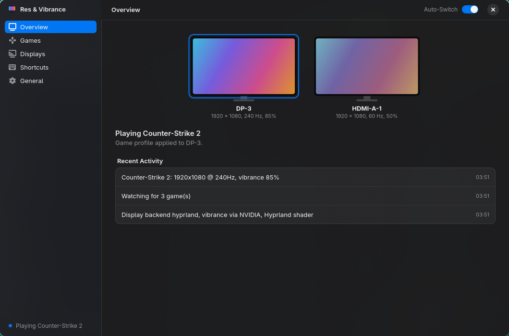

# Res & Vibrance Switch

Automatically switch your **resolution** and **digital vibrance** when a game starts, and put your desktop back when it closes.
Built for competitive FPS players who use stretched resolutions and boosted vibrance, on **Windows** and **Linux**.

- **Automatic switching:** each game gets its own resolution, refresh rate and vibrance the moment it launches, and your desktop settings come back when it closes.
- **Smart alt-tab:** desktop colours while you're in Discord or a browser, game colours when you return.
- **Popular FPS games built in:** installed games are detected for you.
- **Play button:** applies a game's profile and launches it in one click.
- **Multi-monitor:** a desktop profile per monitor, and you pick which monitor each game uses.
- **Global hotkeys:** pause/resume, switch to desktop, or jump to any game's profile.
- **Safe testing:** a new resolution reverts after 15 seconds unless you keep it, and settings are restored after a crash.
- **Share codes:** send your setups to friends or import theirs. Codes work between Windows and Linux.

**[Download the latest release](https://github.com/notreallyaccurate-creator/res-vibrance-switch/releases/latest)**

---

## Windows


### Install

1. Download **`ResVibranceSwitch-Setup-x.y.z.exe`** from the [latest release](https://github.com/notreallyaccurate-creator/res-vibrance-switch/releases/latest).
2. Run it. No admin rights needed; it adds a Start menu entry and an uninstaller.
3. Windows SmartScreen may warn about an unrecognised app because the installer isn't code-signed yet. Click **More info → Run anyway**.

### Requirements

- Windows 10 or 11 (64-bit)
- **Vibrance:** an NVIDIA graphics card (AMD Radeon "Saturation" is supported experimentally; Intel isn't supported)
- **Brightness / contrast / gamma:** unavailable while Windows HDR or Auto Color Management is on for that monitor
- **24 games built in:** CS2, Valorant, Call of Duty, Apex, Fortnite, Overwatch 2, Rainbow Six Siege, PUBG, Battlefield, The Finals, Marvel Rivals, Tarkov and more. Steam, Riot and Epic installs are detected.

### Stretched resolutions

For a game to fill the screen at a stretched resolution (e.g. 1440×1080 on a 1920×1080 monitor), set
**NVIDIA Control Panel → Adjust desktop size and position → Scaling: Full-screen, Perform scaling on: GPU** (once).
Custom resolutions you create in the NVIDIA Control Panel show up in the app automatically.

Settings are stored in `%APPDATA%\ResVibranceSwitch`.

---

## Linux



A native GTK4 app with light and dark mode and a tray icon. It works on Hyprland, KDE Plasma, GNOME, wlroots compositors (sway, niri, river, labwc…) and any X11 desktop.

### Install

**Debian 13, Ubuntu 24.04 and newer (and Mint, Pop!_OS…):** download **`res-vibrance-switch_x.y.z_all.deb`** from the [latest release](https://github.com/notreallyaccurate-creator/res-vibrance-switch/releases/latest), then:

```sh
sudo apt install ./res-vibrance-switch_*_all.deb
```

**Arch / CachyOS / Manjaro, Fedora, openSUSE and others:** install from source. The script installs the system packages it needs, then sets the app up for your user:

```sh
git clone https://github.com/notreallyaccurate-creator/res-vibrance-switch.git
cd res-vibrance-switch/linux
./install.sh
```

Start it from your app menu or run `res-vibrance-switch`.

**NVIDIA owners using the `.deb`:** for real Digital Vibrance on Wayland, also install [nvibrant](https://github.com/Tremeschin/nvibrant) with `pipx install nvibrant`. `install.sh` does this for you.

### What works where

| Desktop | Resolution | Vibrance | Brightness / contrast / gamma | Alt-tab detection | Global hotkeys |
|---|---|---|---|---|---|
| **Hyprland** | ✅ | ✅ any GPU (screen shader), or NVIDIA via nvibrant | ✅ | ✅ instant | ✅ |
| **KDE Plasma** | ✅ `kscreen-doctor` | NVIDIA via nvibrant | – | X11 only | bind command* |
| **GNOME** | ✅ Mutter D-Bus | NVIDIA via nvibrant | – | X11 only | bind command* |
| **sway, river, niri, labwc…** | ✅ `wlr-randr` | NVIDIA via nvibrant | – | – | bind command* |
| **Any X11 desktop** (XFCE, Cinnamon, MATE, i3…) | ✅ `xrandr` | NVIDIA via nvibrant or nvidia-settings | – | ✅ | bind command* |

\*Only Hyprland lets apps register global keys. Elsewhere, the app's **Shortcuts** page shows commands such as
`res-vibrance-switch --action toggle_watch` to add in your desktop's keyboard shortcut settings.

On Hyprland the vibrance shader works on AMD and Intel too. It covers every monitor at once, doesn't appear in screenshots,
and turns off direct scanout while active, which adds a little latency in fullscreen games. It switches off entirely at 50% vibrance.

### Games

The built-in list only includes games whose anti-cheat allows Linux (per [areweanticheatyet.com](https://areweanticheatyet.com)):
CS2, Overwatch 2, The Finals, Marvel Rivals, Arc Raiders, Deadlock, TF2, Halo Infinite, Hunt: Showdown 1896 and Quake Champions.
Installed Steam games are detected. Native games are matched by their binary (`cs2`) and Proton games by their Windows exe
(`Overwatch.exe`). For anything else, use **Add Custom Game** while the game is running.

### Stretched resolutions

The resolution list shows the modes your monitor reports. For stretched resolutions it doesn't list (e.g. 1280×960 at 240 Hz),
use gamescope in the game's Steam launch options:

```
gamescope -w 1280 -h 960 -W 1920 -H 1080 -r 240 -S stretch -f -- %command%
```

Settings are stored in `~/.config/ResVibranceSwitch`.

---

## FAQ

**Is this safe with anti-cheat (Vanguard, VAC, FACEIT)?**
The app never touches game files or memory. It only changes display settings and the driver's vibrance setting,
the same way the NVIDIA Control Panel and VibranceGUI do.

**A game doesn't switch.**
Game updates occasionally rename their executable. Add it again with **+ Custom** (Windows) or **Add Custom Game** (Linux),
and pick it from the list of open apps while it's running.

## Building from source

| Folder | Build |
|---|---|
| `windows/` | `powershell -ExecutionPolicy Bypass -File build.ps1`: PyInstaller exe + Inno Setup 6 installer in `windows\dist\` |
| `linux/` | `./build-deb.sh`: Debian package in `linux/dist/`. `./install.sh` installs from source for the current user. |

Both apps have a command-line engine: `python resvib.py status | run | apply <profile> | modes`.

### Publishing a new version

1. Bump `__version__` in `windows/version.py` and `linux/version.py` (keep them equal).
2. Build the Windows installer with `windows/build.ps1` and the `.deb` with `linux/build-deb.sh`.
3. Create a GitHub release tagged `vX.Y.Z` and attach `ResVibranceSwitch-Setup-X.Y.Z.exe` and `res-vibrance-switch_X.Y.Z_all.deb`.
   Windows users get an update notification.

## License

[MIT](LICENSE)
