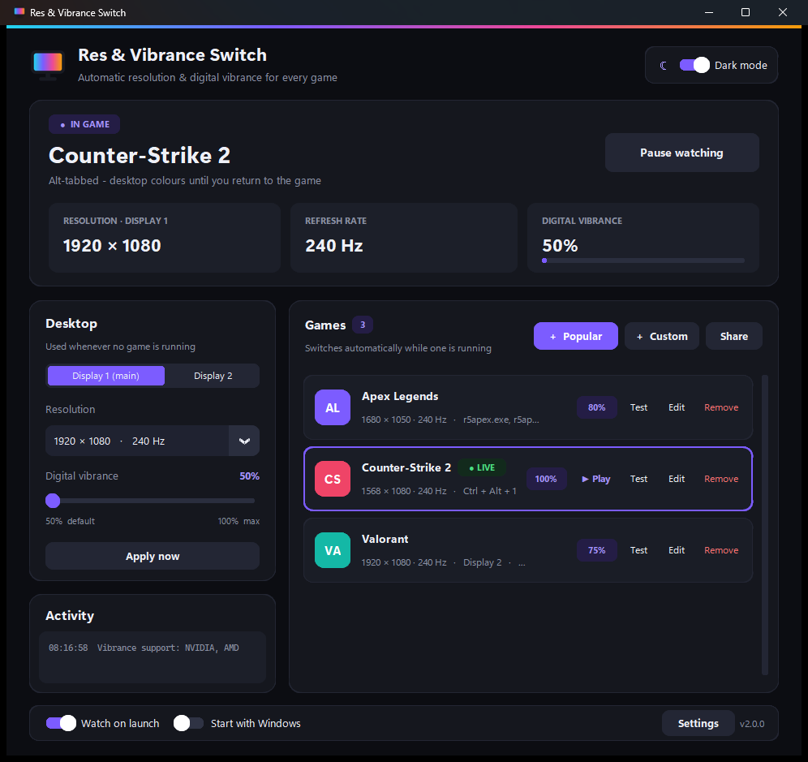

# Res & Vibrance Switch

Automatically switch your **resolution** and **digital vibrance** when a game starts, and put your desktop back when it closes.
Built for competitive FPS players who use stretched resolutions and boosted vibrance in CS2, Valorant, Apex and more.



## Download

Grab the latest version from the **[Releases page](https://github.com/notreallyaccurate-creator/res-vibrance-switch/releases/latest)**:

- **`ResVibranceSwitch-Setup-x.y.z.exe`** – installer (recommended). No admin rights needed; adds a Start menu entry and an uninstaller.
- **`ResVibranceSwitch.exe`** – portable single file. Put it in its own folder; it keeps its settings next to itself.

> Windows SmartScreen may warn about an unrecognised app because the exe isn't code-signed yet.
> Click **More info → Run anyway**.

## Features

- **Automatic switching** – per-game resolution, refresh rate and vibrance applied the moment the game launches; desktop settings restored when it closes.
- **Smart alt-tab** – desktop colours while you're in Discord or a browser, game colours when you return.
- **24 popular FPS games built in** – CS2, Valorant, Call of Duty, Apex, Fortnite, Overwatch 2, Rainbow Six Siege, PUBG, Battlefield, The Finals, Marvel Rivals, Tarkov and more. Installed games (Steam, Riot, Epic and others) are detected for you.
- **Play button** – apply a game's profile and launch it in one click.
- **Multi-monitor** – a desktop profile per monitor; pick which monitor each game uses.
- **Brightness / contrast / gamma** per game.
- **Global hotkeys** – pause/resume, switch to desktop, or jump to any game's profile.
- **Safe testing** – new resolutions revert automatically after 15 seconds unless you keep them; settings are restored after a crash.
- **Share codes** – send your setups to friends or import theirs.
- Dark and light themes, tray icon with live status, switch notifications, first-run setup wizard and update notifications.

## Requirements

- Windows 10 or 11 (64-bit)
- **Vibrance:** an NVIDIA graphics card (AMD Radeon "Saturation" is supported experimentally; Intel isn't supported)
- **Brightness / contrast / gamma:** unavailable while Windows HDR or Auto Color Management is on for that monitor

### Stretched resolutions

For a game to fill the screen at a stretched resolution (e.g. 1440×1080 on a 1920×1080 monitor), set
**NVIDIA Control Panel → Adjust desktop size and position → Scaling: Full-screen, Perform scaling on: GPU** (once).
Custom resolutions you create in the NVIDIA Control Panel show up in the app automatically.

## FAQ

**Is this safe with anti-cheat (Vanguard, VAC, FACEIT)?**
The app never touches game files or memory – it only changes Windows display settings and the driver's vibrance setting,
the same way the NVIDIA Control Panel and VibranceGUI do.

**A game doesn't switch.**
Game updates occasionally rename their exe. Use **+ Custom** and pick the game from "Or pick an open app…" while it's running.

**Where are my settings stored?**
`%APPDATA%\ResVibranceSwitch` (installer) or next to the exe (portable). *Settings → Open settings folder* takes you there.

## Building from source

```powershell
git clone https://github.com/notreallyaccurate-creator/res-vibrance-switch.git
cd res-vibrance-switch
pip install -r requirements.txt
python app.py                                          # run the app
powershell -ExecutionPolicy Bypass -File build.ps1     # build dist\ exe + installer
```

The installer step needs [Inno Setup 6](https://jrsoftware.org/isinfo.php) (`winget install JRSoftware.InnoSetup`).
There's also a command-line version: `python resvib.py status | run | apply <profile> | modes`.

| File | Purpose |
|---|---|
| `app.py` | Interface, tray icon, dialogs |
| `resvib.py` | Engine: displays, resolution, vibrance, gamma, game watcher, config |
| `winevents.py` | Global hotkeys and instant focus detection |
| `detect.py` | Installed-game detection and launching |
| `presets.py` | Built-in game list – add games here |
| `updater.py`, `version.py` | Update checks against GitHub Releases |
| `build.ps1`, `installer.iss` | Build scripts |

### Publishing a new version

1. Bump `__version__` in `version.py`.
2. Run `build.ps1`.
3. Create a GitHub release tagged `vX.Y.Z` and attach both exes from `dist\` – existing users get an update notification.

## License

[MIT](LICENSE)
